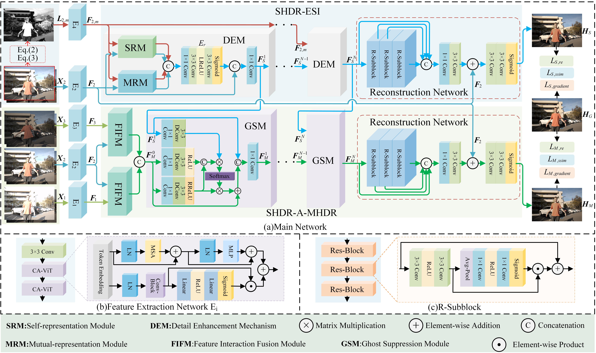

# SAMHDR


# Single-Image HDR Reconstruction Assisted Ghost Suppression and Detail Preservation Network for Multi-Exposure HDR Imaging

The *official* repository for  [Single-Image HDR Reconstruction Assisted Ghost Suppression and Detail Preservation Network for Multi-Exposure HDR Imaging].

## Pipeline



## Requirements

### Installation

```bash
we use /torch >=1.10 / 24G  RTX3090 for training and evaluation.

```

### Prepare Datasets

```bash
mkdir data
```

Download the HDR datasets [Kalantari's data](https://cseweb.ucsd.edu/~viscomp/projects/SIG17HDR/) and [Hu's data](https://github.com/nadir-zeeshan/sensor-realistic-synthetic-data).

Then unzip them and rename them under the directory like.

```
data
├── Training
│   └── 
│   └── 
│   └── 
├── Test
│   └── 
│   └── 
│   └── 
```
To generate the enhanced stop image (ESI) as required in the paper.

```bash
cd dataset
python data_argument.py
```

### Train
We utilize 1 RTX3090 GPU for training.

```bash
python train.py
```

## Evaluation

```bash
python test.py
```

## Contact

If you have any questions, please feel free to contact me.(yangtongxue123_km@163.com).


## Citation

